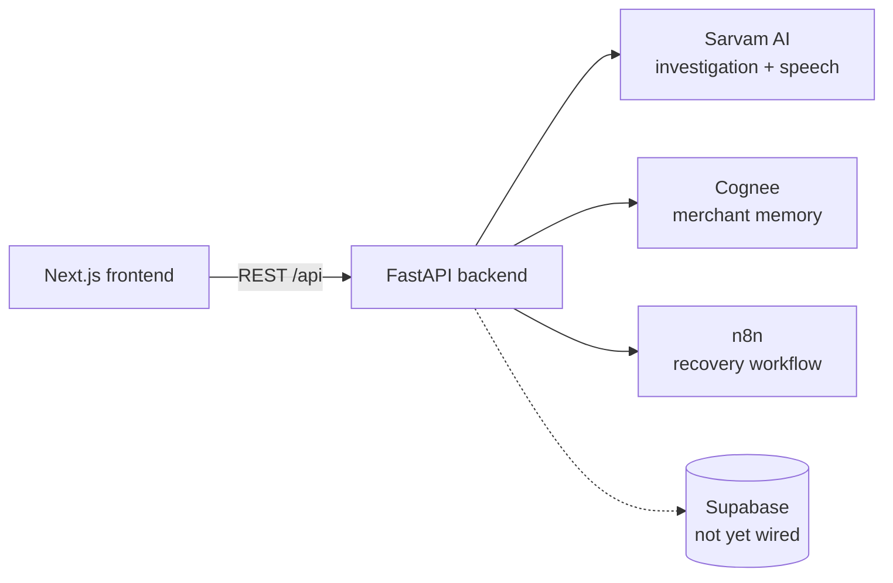

<div align="center">


<br />

     

<br />

**[Run it](#run-it)** &nbsp;·&nbsp; **[Features](#features)** &nbsp;·&nbsp; **[Architecture](#architecture)** &nbsp;·&nbsp; **[Installation](#installation)** &nbsp;·&nbsp; **[API](#api)**

</div>

---

<p align="center">
  
</p>

When a merchant's payments go wrong, the work is manual: find the cause, remember what happened last time, chase the recovery. Niriksh AI is an operations teammate for that job, built for a payments hackathon. It notices a revenue anomaly, opens an investigation, pulls in the merchant's history, lets them talk to it in five Indian languages, and, once they approve, starts a recovery workflow.

The frontend is complete. The backend exposes the final API contract, but most data is mocked until Supabase is wired in, and every integration falls back to mocked data when its key is missing.

## Run it

```bash
git clone https://github.com/Samudra-GITHub/Niriksh-AI.git
cd Niriksh-AI && npm install && npm run dev
```

Then open <http://localhost:3000>. Without the backend running, the frontend falls back to its own demo data and labels it "Illustrative Demo Data" on screen. To use the real backend, see [Installation](#installation).

## Features

<table>
  <tr>
    <td width="50%" valign="top">
      
      <h3>A merchant dashboard</h3>
      <p>Revenue, payment success rate, transactions and an AI health score, a 14-day analytics chart with the anomaly highlighted, an activity feed, an investigations table and a merchant-memory widget.</p>
    </td>
    <td width="50%" valign="top">
      
      <h3>A live investigation</h3>
      <p>An AI-generated investigation (Sarvam AI) with a checklist, a root cause with confidence, similar past incidents from merchant memory (Cognee), and an operations timeline from detect to verify.</p>
    </td>
  </tr>
  <tr>
    <td width="50%" valign="top">
      <h3>A voice copilot</h3>
      <p>Speak to Niriksh or type instead. Speech-to-text and text-to-speech in English, Hindi, Kannada, Tamil and Bengali, with a fallback to typed input when the speech endpoints are unavailable.</p>
    </td>
    <td width="50%" valign="top">
      <h3>Recovery workflow</h3>
      <p>Approving an investigation triggers an n8n webhook. Progress is simulated locally either way, so the flow works end to end without n8n.</p>
    </td>
  </tr>
</table>

**Also:** a landing page covering the problem, architecture, differentiators, impact and business model; a demo-reset endpoint (disabled when `ENVIRONMENT=production`); Swagger UI at `/docs`.

## Tech stack

| Layer | Technology |
| :-- | :-- |
| Frontend | Next.js 15 (App Router), React 19, TypeScript 5, Tailwind CSS 4, Framer Motion, Recharts, shadcn / Base UI, Lucide |
| Backend | FastAPI, Pydantic v2 and pydantic-settings, httpx, Uvicorn |
| Integrations | Sarvam AI (investigation and speech), Cognee (memory), n8n (workflow webhook), Supabase client (schema stubbed) |

## Architecture



Each resource follows the same layering: a thin route in `routes/` calls a service in `services/`, and the service returns Pydantic schemas. Third-party clients (Sarvam, Cognee, n8n, speech) are isolated in their own service modules, which is what lets each fall back on its own.

| Integration | Powers | Without its key |
| :-- | :-- | :-- |
| Sarvam AI (`SARVAM_API_KEY`) | Investigations and the voice copilot | Mocked investigation; speech endpoints return 502 and the UI falls back to typed text |
| Cognee (`COGNEE_API_KEY`) | Merchant memory and timeline | Local mocked history for merchant `M102` |
| n8n (`N8N_WEBHOOK_URL`) | The recovery workflow webhook | Webhook skipped; progress simulated locally |
| Supabase | Database | Not queried yet |

```text
Niriksh-AI/
├── app/                  Next.js routes: landing, dashboard/, investigation/
├── components/           UI sections, with dashboard/ and investigation/ subfolders
├── lib/                  API client (api.ts), demo data, workflow hook
├── backend/
│   ├── app/
│   │   ├── main.py       FastAPI app, CORS, router registration
│   │   ├── routes/       One thin route file per resource
│   │   ├── services/     Sarvam, Cognee, n8n, speech, workflow, dashboard logic
│   │   ├── schemas/      Pydantic request and response models
│   │   └── utils/        Supabase client, classification helpers
│   ├── requirements.txt
│   └── .env.example
└── docs/                 QA report and screenshots
```

### API

All routes are prefixed with `/api`.

| Method | Path | Purpose |
| :-- | :-- | :-- |
| GET | `/health` | Health check |
| GET | `/dashboard` | Dashboard aggregates |
| GET | `/merchant` | Merchant profile |
| GET | `/activity` | Activity feed |
| GET | `/investigation/active` | Active investigation (Sarvam AI) |
| GET | `/investigations` | Investigation list |
| GET | `/memory/timeline` | Merchant memory timeline (Cognee) |
| POST | `/workflow/run` | Start a recovery workflow |
| GET | `/workflow/status/{workflow_id}` | Workflow progress |
| POST | `/speech/transcribe` | Speech to text |
| POST | `/speech/speak` | Text to speech |
| POST | `/demo/reset` | Reset demo state (non-production only) |

## Installation

Requires Node.js, npm and Python 3.

### Backend

```bash
cd backend
python -m venv .venv
.venv\Scripts\activate          # macOS/Linux: source .venv/bin/activate
pip install -r requirements.txt
cp .env.example .env
uvicorn app.main:app --reload   # http://localhost:8000
```

### Frontend

```bash
npm install
npm run dev                     # http://localhost:3000
```

Other scripts: `npm run build`, `npm run start`, `npm run lint`.

### Environment

Backend variables go in `backend/.env` (see `backend/.env.example`): `SARVAM_API_KEY`, `COGNEE_API_KEY`, `N8N_WEBHOOK_URL`, `SUPABASE_URL`, `SUPABASE_ANON_KEY`, and `CORS_ORIGINS` (default `http://localhost:3000`). On the frontend, `NEXT_PUBLIC_API_URL` sets the backend address (default `http://localhost:8000`). Never commit real keys.

### Deploy

No deployment configuration is included.

## Limitations

- Supabase is configured but no queries use it yet, so dashboard, merchant and activity data are mocked.
- No automated tests. A manual QA pass is written up in [docs/qa-report.md](docs/qa-report.md).
- The screenshots above were taken with the frontend running without the backend, so they show its built-in demo data.

## License

[MIT](LICENSE).
