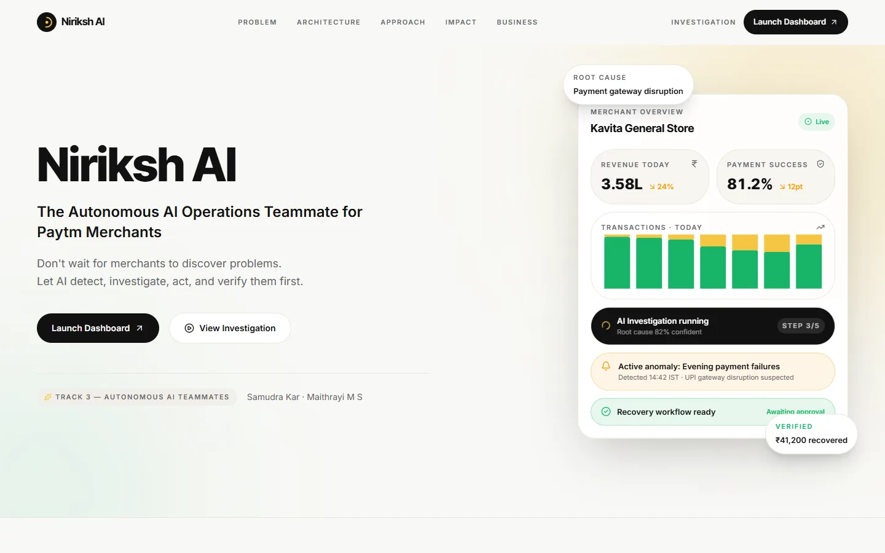
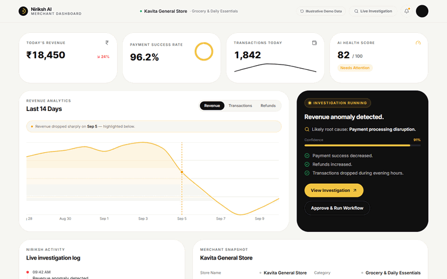
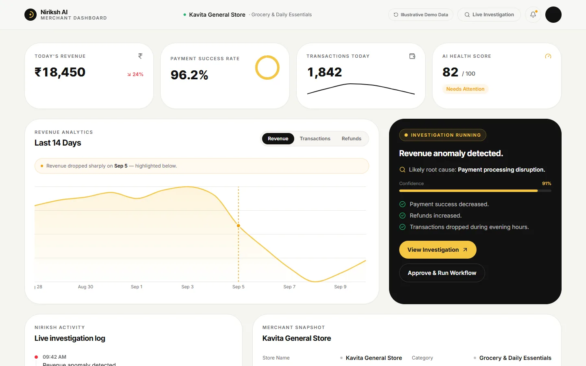
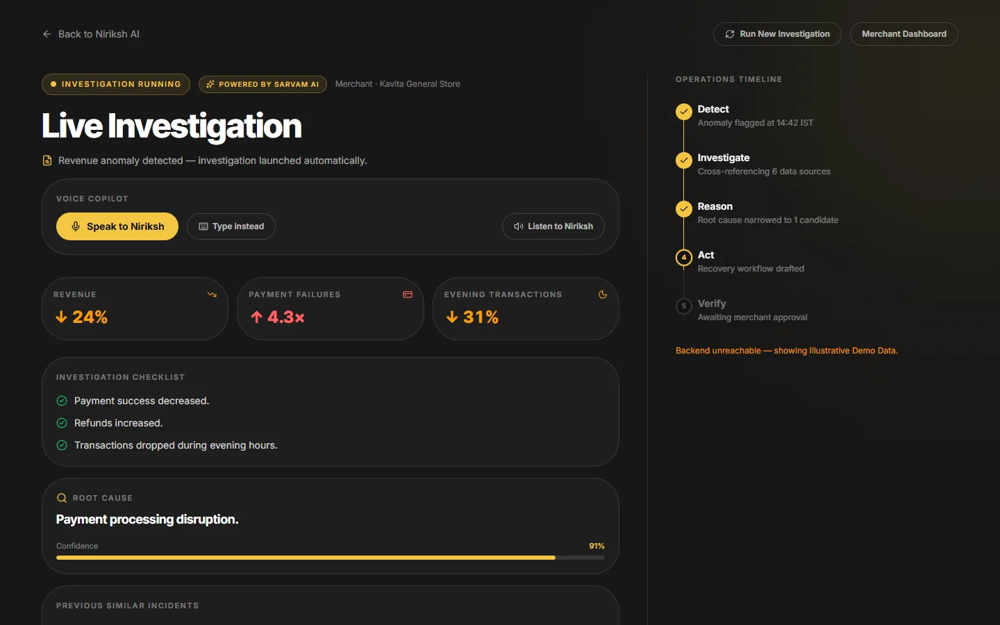
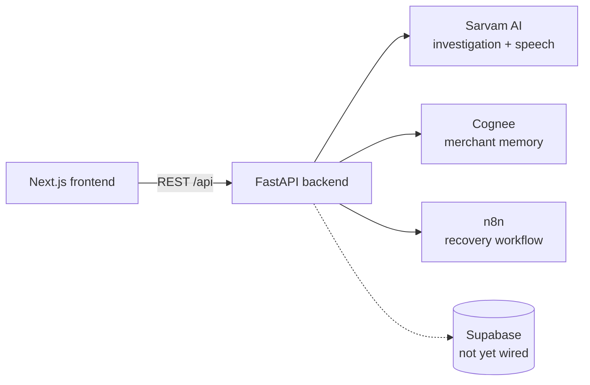

<div align="center">

# Niriksh AI

**An AI copilot that helps merchants investigate failed transactions and trigger recovery, by text or voice.**

Sarvam AI investigations · Cognee memory · n8n recovery workflow · voice in five Indian languages · built for a payments hackathon

<br />

**[Overview](#overview)** &nbsp;·&nbsp; **[Features](#features)** &nbsp;·&nbsp; **[Getting started](#getting-started)** &nbsp;·&nbsp; **[Architecture](#architecture)** &nbsp;·&nbsp; **[Structure](#project-structure)**

<br />

     

</div>

---

## Overview

When a merchant's payments go wrong, the work is manual: find the cause, remember what happened last time, and chase the recovery. Niriksh AI is an "autonomous operations teammate" for that job. It opens an investigation, pulls in the merchant's history, lets them talk to it in several Indian languages, and, once they approve, starts a recovery workflow.

It was built for a payments-focused hackathon. The frontend is complete. The backend exposes the final API contract, but **most data is mocked** until Supabase is wired in (see [Current status](#current-status)).

## Preview

<p align="center">
  
</p>

<p align="center">
  
  <br />
  <sub>The merchant dashboard, recorded from the running frontend.</sub>
</p>

| Dashboard | Live investigation |
| :-- | :-- |
|  |  |

> These captures were taken with the frontend running **without** the FastAPI backend. In that state the UI falls back to its own demo data and labels it "Illustrative Demo Data" on screen. Start the backend (see [Getting Started](#getting-started)) to use live integrations.

## Features

- **Landing page** covering the problem, architecture, differentiators, impact and business model
- **Merchant dashboard** with revenue analytics, overview stats, an activity feed, an investigations table and a merchant-memory widget
- **Investigation view** with an AI-generated active investigation (Sarvam AI) and historical context from merchant memory (Cognee)
- **Voice copilot**: speech-to-text and text-to-speech in English, Hindi, Kannada, Tamil and Bengali, with fallback to typed input
- **Recovery workflow**: a merchant-approved investigation triggers an n8n webhook, and progress is simulated locally either way
- **Demo mode** and a demo-reset endpoint (disabled when `ENVIRONMENT=production`)
- **Graceful degradation**: every integration falls back to mocked data when its key is missing

## Tech Stack

| Layer | Technology |
| --- | --- |
| Frontend | Next.js 15 (App Router), React 19, TypeScript, Tailwind CSS v4, Framer Motion, Recharts, shadcn/Base UI, Lucide |
| Backend | FastAPI, Pydantic v2 / pydantic-settings, httpx, Uvicorn |
| Integrations | Sarvam AI (investigation + speech), Cognee (memory), n8n (workflow webhook), Supabase client (schema stubbed) |

## Project Structure

```
Niriksh-AI/
├── app/                    # Next.js routes
│   ├── page.tsx            # Landing page
│   ├── dashboard/          # Merchant dashboard
│   └── investigation/      # Investigation + copilot view
├── components/             # UI sections; dashboard/ and investigation/ subfolders
├── lib/                    # API client (api.ts), demo data, workflow hook
├── backend/
│   ├── app/
│   │   ├── main.py         # FastAPI app, CORS, router registration
│   │   ├── config.py       # Environment-driven settings
│   │   ├── routes/         # One thin route file per resource
│   │   ├── services/       # Sarvam, Cognee, n8n, speech, workflow, dashboard logic
│   │   ├── schemas/        # Pydantic request/response models
│   │   └── utils/          # Supabase client, classification helpers
│   ├── requirements.txt
│   └── .env.example
├── docs/qa-report.md       # Phase 8 QA report
└── package.json
```

## Getting Started

**Prerequisites:** Node.js, npm and Python 3.

### Backend

```bash
cd backend
python -m venv .venv
.venv\Scripts\activate          # macOS/Linux: source .venv/bin/activate
pip install -r requirements.txt
cp .env.example .env
uvicorn app.main:app --reload   # http://localhost:8000
```

Swagger UI is served at `http://localhost:8000/docs` unless `ENVIRONMENT=production`.

### Frontend

```bash
npm install
npm run dev                     # http://localhost:3000
```

Other scripts: `npm run build`, `npm run start`, `npm run lint`.

## Configuration

Backend (`backend/.env`, see `backend/.env.example`):

| Variable | Purpose | If blank |
| --- | --- | --- |
| `SARVAM_API_KEY` | Investigations and voice copilot | Mocked investigation; speech endpoints return 502 and the UI falls back to typed text |
| `COGNEE_API_KEY` | Merchant memory | Local mocked history for merchant `M102` |
| `N8N_WEBHOOK_URL` | Recovery workflow webhook | Webhook skipped; progress simulated locally |
| `SUPABASE_URL`, `SUPABASE_ANON_KEY` | Database | Not queried yet |
| `CORS_ORIGINS` | Allowed origins | Defaults to `http://localhost:3000` |

Frontend: `NEXT_PUBLIC_API_URL` sets the backend URL (default `http://localhost:8000`).

## Architecture



Each resource follows the same layering: a thin route in `routes/` calls a service in `services/`, and the service returns Pydantic schemas. Third-party clients (Sarvam, Cognee, n8n, speech) are isolated in their own service modules, which is what lets each fall back independently.

### API

All routes are prefixed with `/api`.

| Method | Path | Purpose |
| --- | --- | --- |
| GET | `/health` | Health check |
| GET | `/dashboard` | Dashboard aggregates |
| GET | `/merchant` | Merchant profile |
| GET | `/activity` | Activity feed |
| GET | `/investigation/active` | Active investigation (Sarvam AI) |
| GET | `/investigations` | Investigation list |
| GET | `/memory/timeline` | Merchant memory timeline (Cognee) |
| POST | `/workflow/run` | Start a recovery workflow |
| GET | `/workflow/status/{workflow_id}` | Workflow progress |
| POST | `/speech/transcribe` | Speech to text |
| POST | `/speech/speak` | Text to speech |
| POST | `/demo/reset` | Reset demo state (non-production only) |

## Current status

- Supabase is configured but no queries use it yet, so dashboard, merchant and activity data are mocked.
- A QA pass is documented in [docs/qa-report.md](docs/qa-report.md).

## Deployment

No deployment configuration is included in this repository.

## Future Improvements

- Replace mocked data with Supabase-backed queries
- Multi-merchant case history
- Add automated tests (the repo currently has none)

## License

MIT, see [LICENSE](LICENSE).
